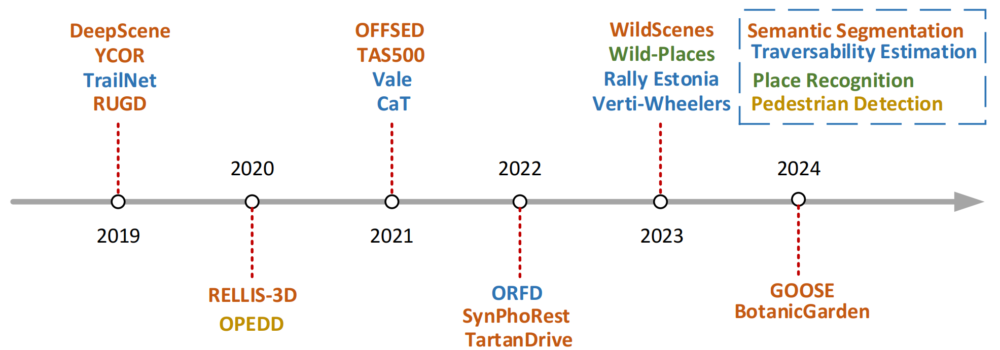

# [Autonomous Driving in Unstructured Environments: How Far Have We Come?](https://arxiv.org/abs/2410.07701) [](https://github.com/sindresorhus/awesome)  [](https://arxiv.org/abs/2410.07701) 

<p align="center">
  
</p>
<p align="center">
(Unstructured Environments.)
</p>

## 📌 Introduction

Research on autonomous driving in unstructured outdoor environments is less advanced than in structured urban settings due to challenges like environmental diversities and scene complexity. These environments-such as rural areas and rugged terrains-pose unique obstacles that are not common in structured urban areas. Despite these difficulties, autonomous driving in unstructured outdoor environments is crucial for applications in agriculture, mining, and military operations. Our survey reviews over 250 papers for autonomous driving in unstructured outdoor environments, covering offline mapping, pose estimation, environmental perception, path planning, end-to-end autonomous driving, datasets, and relevant challenges. We also discuss emerging trends and future research directions. This review aims to consolidate knowledge and encourage further research for autonomous driving in unstructured environments.

## Table of Contents

- [Survey Papers](#Survey-Papers-for-Autonomous-Driving-in-Unstructured-Environments)
- [Datasets](#Papers-for-Autonomous-Driving-Datasets-in-Unstructured-Environments)
- [Offline Mapping](#Papers-for-Autonomous-Driving-Offline-Mapping-in-Unstructured-Environments )
- [Pose Estimation](#Papers-for-Autonomous-Driving-Pose-Estimation-in-Unstructured-Environments )
- [Perception](#Papers-for-Autonomous-Driving-Perception-in-Unstructured-Environments )
- [Path Planning](#Papers-for-Autonomous-Driving-Path-Planning-in-Unstructured-Environments )
- [End-to-End Driving](#Papers-for-End-to-End-Autonomous-Driving-in-Unstructured-Environments) 
- [Citation](#Contact)

## Survey Papers for Autonomous Driving in Unstructured Environments 

| Year |              Journal/Conference               |                     Authors                     |                            Title                             |                Task                |
| ---- | :--------------------------------------: | :--------------------------------------------: | :----------------------------------------------------------: | :--------------------------------: |
| 2020 |                 Sensors                  |    Università degli Studi di Catania, Italy    | [Learning-Based Methods of Perception and Navigation for Ground Vehicles in Unstructured Environments: A Review](https://www.mdpi.com/1424-8220/21/1/73) |     Traversability Analysis      |
| 2022 |                   JFR                    | Queensland University of Technology, Australia | [A Survey on Terrain Traversability Analysis for Autonomous Ground Vehicles: Methods, Sensors, and Challenges](https://www.journalfieldrobotics.org/Field_Robotics/Volume_2_files/Vol2_49.pdf) |      Traversability Analysis       |
| 2022 |                 Sensors                  |       Mississippi State University, USA        | [Off-Road Detection Analysis for Autonomous Ground Vehicles: A Review](https://www.mdpi.com/1424-8220/22/21/8463) |      Traversability Analysis       |
| 2023 |             Applied Sciences             |       Edith Cowan University,  Australia       | [Challenges and Solutions for Autonomous Ground Robot Scene Understanding and Navigation in Unstructured Outdoor Environments: A Review](https://www.mdpi.com/2076-3417/13/17/9877) | Scene Understanding and Navigation |
| 2023 | Journal of Intelligent & Robotic Systems |  Memorial University of Newfoundland, Cannada  | [A Survey of Off-Road Mobile Robots: Slippage Estimation, Robot Control, and Sensing Technology](https://link.springer.com/article/10.1007/s10846-023-01968-2) |           Mobile Robots            |
| 2024 |                 Machines                 |            Jilin University, China             | [A Survey on Path Planning for Autonomous Ground Vehicles in Unstructured Environments](https://www.mdpi.com/2075-1702/12/1/31) |           Path Planning            |
| 2024 |              ICRA workshop               |  University of the Bundeswehr Munich, Germany  | [Survey on Datasets for Perception in Unstructured Outdoor Environments](https://arxiv.org/abs/2404.18750) |              Datasets              |

## Papers for Autonomous Driving Datasets in Unstructured Environments 



| Year |                           Datasets                           |                            Title                             |                Sensors                 |                            Task                             |                             Link                             |
| :--: | :----------------------------------------------------------: | :----------------------------------------------------------: | :------------------------------------: | :---------------------------------------------------------: | :----------------------------------------------------------: |
| 2017 | [DeepScene](https://link.springer.com/chapter/10.1007/978-3-319-50115-4_41) | [Deep Multispectral Semantic Scene Understanding of Forested Environments Using Multimodal Fusion](https://link.springer.com/chapter/10.1007/978-3-319-50115-4_41) |          RGB, NIR, and depth           |                    Semantic Segmentation                    |  [Download](http://deepscene.cs.uni-freiburg.de/#datasets)   |
| 2018 | [YCOR](https://link.springer.com/chapter/10.1007/978-3-319-67361-5_22) | [YCOR: Real-Time Semantic Mapping for Autonomous Off-Road Navigation](https://link.springer.com/chapter/10.1007/978-3-319-67361-5_22) |                  RGB                   |                    Semantic Segmentation                    |          [Download](https://dimatura.net/offroad/)           |
| 2018 | [TrailNet](https://pdfs.semanticscholar.org/6008/e459f5d1226843eb88ea1af029687c9d2287.pdf) | [Autonomous Trail Following using a Pre-trained Deep Neural Network](https://pdfs.semanticscholar.org/6008/e459f5d1226843eb88ea1af029687c9d2287.pdf) |               RGB Camera               |                  Traversability Estimation                  |     [Download](https://vgr.lab.yorku.ca/tools/trailnet/)     |
| 2019 | [RUGD](https://ieeexplore.ieee.org/abstract/document/8968283) | [A RUGD Dataset for Autonomous Navigation and Visual Perception in Unstructured Outdoor Environments](https://ieeexplore.ieee.org/abstract/document/8968283) |                  RGB                   |                    Semantic Segmentation                    |  [Download](https://www.dfki.uni-kl.de/~neigel/offsed.html)  |
| 2020 | [OPEDD](https://www.dfki.de/fileadmin/user_upload/import/10861_WSCG_OPEDD.pdf) | [OPEDD: Off-Road Pedestrian Detection Dataset](https://www.dfki.de/fileadmin/user_upload/import/10861_WSCG_OPEDD.pdf) |             Stereo images              |                    Pedestrian Detection                     |  [Download](https://www.dfki.uni-kl.de/~neigel/offsed.html)  |
| 2020 |        [RELLIS-3D](https://arxiv.org/abs/2011.12954)         | [RELLIS-3D: A Multi-modal Dataset for Off-Road Robotics](https://arxiv.org/abs/2011.12954) |             camera, LiDAR              |                    Semantic Segmentation                    |     [Download](https://github.com/unmannedlab/RELLIS-3D)     |
| 2021 | [OFFSED](https://www.dfki.de/fileadmin/user_upload/import/11376_OFFSEDD_VISAPP2021.pdf) | [OFFSED: Off-Road Semantic Segmentation Dataset](https://www.dfki.de/fileadmin/user_upload/import/11376_OFFSEDD_VISAPP2021.pdf) |           RGB, stereo depth            |                    Semantic Segmentation                    |  [Download](https://www.dfki.uni-kl.de/~neigel/offsed.html)  |
| 2021 | [TAS500](https://ieeexplore.ieee.org/abstract/document/9411987) | [A Fine-Grained Dataset and its Efficient Semantic Segmentation for Unstructured Driving Scenarios](https://ieeexplore.ieee.org/abstract/document/9411987) |                  RGB                   |                    Semantic Segmentation                    |      [Download](https://www.mucar3.de/icpr2020-tas500)       |
| 2021 | [Vale](https://ieeexplore.ieee.org/abstract/document/9551629) | [Traversability Analysis by Semantic Terrain Segmentation for Mobile Robots](https://ieeexplore.ieee.org/abstract/document/9551629) |               RGB Camera               |                  Traversability Estimation                  | [Download](https://www.kaggle.com/datasets/sadhoss/vale-semantic-terrain-segmentation) |
| 2021 | [CaT](https://ieeexplore.ieee.org/abstract/document/9721297) | [CaT: CAVS Traversability Dataset for Off-Road Autonomous Driving](https://ieeexplore.ieee.org/abstract/document/9721297) |               RGB camera               |                  Traversability Estimation                  |           [Download](https://datasetninja.com/cat)           |
| 2022 |  [SynPhoRest](https://openreview.net/forum?id=rpzgjNCe4G9)   | [Procedural Generation of Synthetic Forest Environments to Train Machine Learning Algorithms](https://openreview.net/forum?id=rpzgjNCe4G9) |           RGB Camera, Depth, LiDAR            |                    Semantic Segmentation                    |        [Download](https://zenodo.org/records/6369446)        |
| 2022 |       [TartanDrive](https://arxiv.org/pdf/2205.01791)        | [TartanDrive: A Large-Scale Dataset for Learning Off-Road Dynamics Models](https://arxiv.org/pdf/2205.01791) |            stereo images -             |                              -                              |     [Download](https://github.com/castacks/tartan_drive)     |
| 2022 |           [ORFD](https://arxiv.org/abs/2206.09907)           | [ORFD: A Dataset and Benchmark for Off-Road Freespace Detection](https://arxiv.org/abs/2206.09907) |          RGB camera and LiDAR          |                  Traversability Estimation                  | [Download](https://github.com/chaytonmin/Off-Road-Freespace-Detection) |
| 2023 |  [Rally Estonia](https://www.mdpi.com/1424-8220/23/5/2845)   | [LiDAR-as-Camera for End-to-End Driving](https://www.mdpi.com/1424-8220/23/5/2845) |          RGB camera and LiDAR          |                  Traversability Estimation                  |   [Download](https://github.com/UT-ADL/e2e-rally-estonia)    |
| 2023 |      [Verti-Wheelers](https://arxiv.org/abs/2303.00998)      | [Toward Wheeled Mobility on Vertically Challenging Terrain: Platforms, Datasets, and Algorithms](https://arxiv.org/abs/2303.00998) |             Kinect Camera              |                  Traversability Estimation                  | [Download](https://cs.gmu.edu/~xiao/Research/Verti-Wheelers/) |
| 2023 |      [WildScenes](https://arxiv.org/abs/2312.15364)      | [WildScenes: A Benchmark for 2D and 3D Semantic Segmentation in Large-scale Natural Environments](https://arxiv.org/abs/2312.15364) |             RGB Camera, LiDAR             |                  Semantic Segmentation                  | [Download](https://csiro-robotics.github.io/WildScenes/) |
| 2023 |      [Wild-Places](https://ieeexplore.ieee.org/abstract/document/10160432)      | [Wild-Places: A Large-Scale Dataset for Lidar Place Recognition in Unstructured Natural Environments](https://ieeexplore.ieee.org/abstract/document/10160432) |             LiDAR             |                  Place Recognition                  | [Download](https://csiro-robotics.github.io/Wild-Places/) |
| 2024 | [BotanicGarden](https://ieeexplore.ieee.org/abstract/document/10415477/) | [BotanicGarden: A High-Quality Dataset for Robot Navigation in Unstructured Natural Environments](https://ieeexplore.ieee.org/abstract/document/10415477/) | Gray and RGB stereo cameras, and LiDAR | Ego-motions, 3D map ground truth, and Semantic Segmentation |   [Download](https://github.com/robot-pesg/BotanicGarden)    |
| 2024 |          [GOOSE](https://arxiv.org/abs/2310.16788)           | [The GOOSE Dataset for Perception in Unstructured Environments](https://arxiv.org/abs/2310.16788) |            RGB+NIR / LiDAR             |                    Semantic Segmentation                    |            [Download](https://goose-dataset.de/)             |
|      |                                                              |                                                              |                                        |                                                             |                                                              |
| 2024 |                            Survey                            | [Survey on Datasets for Perception in Unstructured Outdoor Environments](https://arxiv.org/abs/2404.18750) |             ICRA workshop              |             University of the Bundeswehr Munich             |                              -                               |

## Papers for Autonomous Driving Offline Mapping in Unstructured Environments 

| Year | Journal/Conference | Authors | Title | Task | Github |
| ---- | :-----------: | :----: | :---: | :--: | :----: |
|   2020   |        Robotics       |    NUDT    |    [LIDAR scan matching in off-road environments](https://www.mdpi.com/2218-6581/9/2/35)   |   Mapping   |    -    |
|   2020   |        TIM       |        |    [Gem: online globally consistent dense elevation mapping for unstructured terrain](https://ieeexplore.ieee.org/abstract/document/9293017/)   |   Mapping   |    https://github.com/ZJU-Robotics-Lab/GEM    |
| 2021 |        Remote Sensing       |    NUDT    |    [Towards a fully automated 3d reconstruction system based on lidar and gnss in challenging scenarios](https://www.mdpi.com/2072-4292/13/10/1981)    |   Mapping   |    -    |
|   2021   |       IV        |        |    [Fully automatic large-scale point cloud mapping for low-speed self-driving vehicles in unstructured environments](https://ieeexplore.ieee.org/abstract/document/9575571/)   |   Mapping   |    -   |
| 2021 |        JFR       |    NUDT    |    [LiDAR‐based robust localization for field autonomous vehicles in off‐road environments](https://onlinelibrary.wiley.com/doi/abs/10.1002/rob.22031)    |  offline Mapping  |    -    | 
|   2021   |        SN Applied Sciences       |        |    [Mapping in unstructured natural environment: A sensor fusion framework for wearable sensor suites](https://link.springer.com/article/10.1007/s42452-021-04555-y)   |   Mapping   |    -    |
| 2022 |       RA-L        |    MIT    |    [Maplite 2.0: Online hd map inference using a prior sd map](https://ieeexplore.ieee.org/abstract/document/9807400/)   |   online HD-Mapping   |    -    |
|   2023   |        Drones       |        |    [A Safety-Assured Semantic Map for an Unstructured Terrain Environment towards Autonomous Engineering Vehicles](https://www.mdpi.com/2504-446X/7/9/550)   |   Semantic Mapping   |    -    |
|   2023   |       ICUS        |        |    [Real-Time Generation and Automatic Update of 3D Point Cloud Maps in Featureless Environments Based on Multi-Sensor Fusion](https://ieeexplore.ieee.org/abstract/document/10318508/)   |   Mapping   |    -    |
|   2024   |       JFR        |        |   [Three‐dimensionalized feature‐based LiDAR‐visual odometry for online mapping of unpaved road surfaces](https://onlinelibrary.wiley.com/doi/abs/10.1002/rob.22334)    |   online Mapping   |    -    |
|   2024   |       JFR       |    HKU    |    [LTA‐OM: Long‐term association LiDAR–IMU odometry and mapping](https://onlinelibrary.wiley.com/doi/pdf/10.1002/rob.22337)   |   Localization & Mapping   |    https://github.com/hku-mars/LTAOM    |
|   2024   |       arXiv       |    MIT    |    [Outlier-Robust Long-Term Robotic Mapping Leveraging Ground Segmentation](https://arxiv.org/pdf/2405.11176)   |   Mapping   |    -    |
|   2024   |       arXiv        |    HKUST    |    [MS-Mapping: Multi-session LiDAR Mapping with Wasserstein-based Keyframe Selection](https://arxiv.org/abs/2406.02096)   |   Mapping   |    https://github.com/JokerJohn/MS-Mapping    |

## Papers for Autonomous Driving Pose Estimation in Unstructured Environments 

### (1) Localization within Priori HD-Map Review 
| Year | Journal/Conference | Authors | Title | Task | Github |
| ---- | :-----------: | :----: | :---: | :--: | :----: |
|   2017   |        IJRR       |        |    [Robust LIDAR localization using multiresolution Gaussian mixture maps for autonomous driving](https://journals.sagepub.com/doi/abs/10.1177/0278364917696568)   |   Localization   |    -    |
| 2018 |        IROS       |        |    [Posemap: Lifelong, multi-environment 3d lidar localization](https://ieeexplore.ieee.org/abstract/document/8593854/)   |   Mapping then Localization   |    -    |
|   2019   |        Remote Sensing       |    Tongji University    |   [A Precise and Robust Segmentation-Based Lidar Localization System for Automated Urban Driving](https://www.mdpi.com/2072-4292/11/11/1348)    |   Localization   |    -    |
|   2020   |        Remote Sensing       |        |    [Localization in unstructured environments: Towards autonomous robots in forests with delaunay triangulation](https://www.mdpi.com/2072-4292/12/11/1870/pdf)   |   Localization   |    -    |
| 2021 |        JFR       |    NUDT    |    [LiDAR‐based robust localization for field autonomous vehicles in off‐road environments](https://onlinelibrary.wiley.com/doi/abs/10.1002/rob.22031)    |  Localization  |    -    | 
|   2022   |        IROS       |        |   [Roll: Long-term robust lidar-based localization with temporary mapping in changing environments](https://ieeexplore.ieee.org/abstract/document/9982153/)    |   Localization   |     https://github.com/HaisenbergPeng/ROLL    |
|      |               |        |       |      |        |
|   2023   |       ECMR       |        |    [Learned long-term stability scan filtering for robust robot localisation in continuously changing environments](https://ieeexplore.ieee.org/abstract/document/10256419/)   |   Localization   |     -   |
|   2024   |       JFR       |    HKU    |    [LTA‐OM: Long‐term association LiDAR–IMU odometry and mapping](https://onlinelibrary.wiley.com/doi/pdf/10.1002/rob.22337)   |   Localization & Mapping   |    https://github.com/hku-mars/LTAOM    |

### (2) Localization without Priori HD-Map Review 
* Diverse Odometry / SLAM 

| Year | Journal/Conference | Authors | Title | Task | Github |
| ---- | :-----------: | :----: | :---: | :--: | :----: |
|   2009   |       JFR        |        |    [Gamma‐SLAM: Visual SLAM in unstructured environments using variance grid maps](https://cseweb.ucsd.edu/~gary/pubs/Gamma-SLAM-JFR-2009.pdf)   |   vSLAM   |     -   |
|   2014   |        RSS |   CMU    |    [LOAM: Lidar odometry and mapping in real-time.](https://www.ri.cmu.edu/pub_files/2014/7/Ji_LidarMapping_RSS2014_v8.pdf)    |   SLAM    |   https://github.com/laboshinl/loam_velodyne   |
|   2015   |       ICRA        |    CMU    |    [Visual-lidar odometry and mapping: Low-drift, robust, and fast](https://ieeexplore.ieee.org/abstract/document/7139486/)   |   SLAM   |    -    |
|   2018   |       IROS        |        |   [Lego-loam: Lightweight and ground-optimized lidar odometry and mapping on variable terrain](https://ieeexplore.ieee.org/abstract/document/8594299/)    |   SLAM   |     https://github.com/RobustFieldAutonomyLab/LeGO-LOAM    |
|   2018   |        JFR       |    CMU    |    [Laser–visual–inertial odometry and mapping with high robustness and low drift](https://onlinelibrary.wiley.com/doi/abs/10.1002/rob.21809)   |   SLAM   |    -    |
|   2019   |       Applied Sciences        |    NUDT    |    [IMU-aided high-frequency LiDAR odometry for autonomous driving](https://www.mdpi.com/2076-3417/9/7/1506)   |   Localization   |    -    |
|   2020   |       RA-L        |        |    [LOCUS: A Multi-Sensor Lidar-Centric Solution for High-Precision Odometry and 3D Mapping in Real-Time](https://arxiv.org/pdf/2012.14447)   |   SLAM   |    -    |
|   2021   |        RA-L       |        |    [Direct LiDAR Odometry: Fast Localization with Dense Point Clouds](https://ieeexplore.ieee.org/abstract/document/9681177/)   |   Localization   |    https://github.com/vectr-ucla/direct_lidar_odometry    |
|   2021   |        ICRA       |        |    [LVI-SAM: Tightly-coupled Lidar-Visual-Inertial Odometry via Smoothing and Mapping](https://arxiv.org/pdf/2104.10831)   |   SLAM   |    https://github.com/TixiaoShan/LVI-SAM    |
|   2021   |       arXiv        |        |    [GPGM-SLAM: a robust slam system for unstructured planetary environments with gaussian process gradient maps](https://arxiv.org/pdf/2109.06596)   |   SLAM   |        |
|   2022   |       RA-L        |    HKU    |    [Efficient and probabilistic adaptive voxel mapping for accurate online lidar odometry](https://ieeexplore.ieee.org/abstract/document/9813516/)   |   Localization   |     https://github.com/hku-mars/VoxelMap   |
|   2022   |       Remote Sensing       |        |    [LiDAR Odometry and Mapping Based on Neighborhood Information Constraints for Rugged Terrain](https://www.mdpi.com/2072-4292/14/20/5229)   |   SLAM   |     -   |
|   2023   |        TRO       |        |    [X-icp: Localizability-aware lidar registration for robust localization in extreme environments](https://ieeexplore.ieee.org/abstract/document/10328716/)   |   Localization   |    -    |
|   2023   |       Measurement Science and Technology    |        |    [An intensity-enhanced LiDAR SLAM for unstructured environments](https://iopscience.iop.org/article/10.1088/1361-6501/acf38d/meta)   |   SLAM   |    -    |
|   2024   |        RA-L       |        |    [Switch-SLAM: Switching-Based LiDAR-Inertial-Visual SLAM for Degenerate Environments](https://ieeexplore.ieee.org/abstract/document/10582434/)   |   SLAM   |    -    |
|   2024   |        Measurement       |        |    [Highly robust and accurate multi-sensor fusion localization system for complex and challenging scenarios](https://www.sciencedirect.com/science/article/pii/S026322412400736X)   |   Localization   |    -    |
|   2024   |        TAES       |    HEU    |    [ROSE: Covisibility Region Aware 3D-LiDAR SLAM based on Generative Road Surface Model and Long-term Association](https://ieeexplore.ieee.org/abstract/document/10582431/)   |   SLAM   |    https://github.com/SiShuBin/ROSE    |

* Place Recognition & Re-Localization 

| Year | Journal/Conference | Authors | Title | Task | Github |
| ---- | :-----------: | :----: | :---: | :--: | :----: |
|   2022   |        Sensors       |        |    [STV-SC: Segmentation and Temporal Verification Enhanced Scan Context for Place Recognition in Unstructured Environment](https://www.mdpi.com/1424-8220/22/22/8604)   |   Place Recognition   |    -    |
|   2023   |        RA-L       |        |    [Place recognition of large-scale unstructured orchards with attention score maps](https://ieeexplore.ieee.org/abstract/document/10008029/)   |   Place Recognition   |    -    |
|   2023   |        IROS       |        |    [Deep robust multi-robot re-localisation in natural environments](https://ieeexplore.ieee.org/abstract/document/10341798/)   |   Re-Localization   |    -    |
|   2024   |        TRO       |    HKU    |   [BTC: A Binary and Triangle Combined Descriptor for 3D Place Recognition](https://ieeexplore.ieee.org/abstract/document/10388464/)    |   Place Recognition   |    https://github.com/hku-mars/btc_descriptor    |
|   2024   |       arXiv        |        |    [Towards Long-term Robotics in the Wild](https://arxiv.org/abs/2404.18477)   |   Place Recognition   |    -    |
|   2024   |       arXiv       |        |    [Evaluation and Deployment of LiDAR-based Place Recognition in Dense Forests](https://arxiv.org/abs/2403.14326)   |   Place Recognition   |    https://ori-drs.github.io/datasets/    |
|   2024   |       arXiv       |        |    [PointNetPGAP-SLC: A 3D LiDAR-based Place Recognition Approach with Segment-level Consistency Training for Mobile Robots in Horticulture](https://arxiv.org/abs/2405.19038)   |   Place Recognition   |    https://github.com/Cybonic/PointNetPGAP-SLC.git    |

* Localization with Lightweight Map

| Year | Journal/Conference | Authors | Title | Task | Github |
| ---- | :-----------: | :----: | :---: | :--: | :----: |
|   2019   |        ITSC       |        |   [Unstructured road slam using map predictive road tracking](https://ieeexplore.ieee.org/abstract/document/8917129/)    |   SLAM   |    -    |
| 2019 |        RA-L       |    MIT    |   [Maplite: Autonomous intersection navigation without a detailed prior map](https://ieeexplore.ieee.org/abstract/document/8936918/)    |   localization and navigation   |    -    | 
| 2022 |       TAES        |    HEU    |    [TOM-odometry: A generalized localization framework based on topological map and odometry](https://ieeexplore.ieee.org/abstract/document/9940585/)   |   Localization   |    -    |
|   2023   |       IROS        |        |   [Global localization in unstructured environments using semantic object maps built from various viewpoints](https://ieeexplore.ieee.org/abstract/document/10342267/)    |   Loc with Semantic Map   |    -    |
|   2023   |        arXiv       |        |    [ALT-Pilot: Autonomous navigation with Language augmented Topometric maps](https://arxiv.org/abs/2310.02324)   |      |    -    |

## Papers for Autonomous Driving Perception in Unstructured Environments 

| Year |                        Journal/Conference                         |                            Authors                         |                            Title                             |                       Task                       | Github |
| ---- | :----------------------------------------------------------: | :----------------------------------------------------------: | :----------------------------------------------------------: | :----------------------------------------------: | :----: |
| 2003 |                              IV                              | Vehicle-Infrastructure-Driver Interactions Research Unit - LIkX | [ A single framework for vehicle roll, pitch, yaw estimation and obstacles detection by stereovision](https://ieeexplore.ieee.org/abstract/document/1212878) |                Obstacle Detection                |   -    |
| 2004 |                              -                               |                  Carnegie Mellon University                  | [Vegetation Detection for Mobile Robot Navigation](https://www.ri.cmu.edu/pub_files/pub4/bradley_david_2004_2/bradley_david_2004_2.pdf) |           Positive Obstacle Detection            |   -    |
| 2004 |                             ICRA                             |                  Carnegie Mellon University                  | [Classifier Fusion for Outdoor Obstacle Detection](https://ieeexplore.ieee.org/abstract/document/1307225/) |                Obstacle Detection                |   -    |
| 2005 |                        CVPR workshop                         |                     University of Parma                      | [Obstacle Detection with Stereo Vision for Off-Road Vehicle Navigation](https://ieeexplore.ieee.org/abstract/document/1565369) |                Obstacle Detection                |   -    |
| 2005 |                              -                               |             Jet Propulsion Laboratory, Pasadena              | [Evaluation of Stereo Vision Obstacle Detection Algorithms for Off-Road Autonomous Navigation](https://d1wqtxts1xzle7.cloudfront.net/36673835/05-1610-libre.pdf?1424219841=&response-content-disposition=inline%3B+filename%3DEvaluation_of_Stereo_Vision_Obstacle_Det.pdf&Expires=1717984213&Signature=P~hg592-dGdU5alAgHlnEmkBsjbHcBDEszK45scSO6jLshX-hPqYdOMq700kJnsU7QI6tdJaLmRTkI4pcJ6m2tUH-Pqc65azQU24edIcOPuQGqI2EwJOYN17cjJ~q0DE5tU0Z1c~oxg9QlKE11RzeNLhiVk~ocqc-cyI19F9djL8YIfLqid7y0rNOuo3D3ltgCQU9K0ReXXnYUn-2ToymRlbNycsCXBx20XxlySSEi0zP6oghhDALMTmzTQhs9IS5CWcx5D7KC8-Nr9n0hPQE4Mc92oqEYrXDQ5VcgHC4w~ihRWt~KY5~GUJkBF111swgW~Lmgcybb73BsLBc51uHw__&Key-Pair-Id=APKAJLOHF5GGSLRBV4ZA) |                Obstacle Detection                |   -    |
| 2005 |                             WACV                             |              California Institute of Technology              | [Stereo-Based Tree Traversability Analysis for Autonomous Off-Road Navigation]() |       Positive Obstacle (Forest）Detection       |   -    |
| 2005 |                      Autonomous robots                       |         California Institute of Technology, Pasadena         | [Obstacle Detection and Terrain Classification for Autonomous Off-Road Navigation](https://link.springer.com/article/10.1023/B:AURO.0000047286.62481.1d) |  Obstacle Detection and Terrain Classification   |   -    |
| 2007 |                             IROS                             |                  Carnegie Mellon University                  | [Potential Negative Obstacle Detection by Occlusion Labeling](https://ieeexplore.ieee.org/abstract/document/4398970) |           Negative Obstacle Detection            |   -    |
| 2011 |                             ITSC                             |             University of California, San Diego              | [Lidar Based Off-road Negative Obstacle Detection and Analysis](https://ieeexplore.ieee.org/abstract/document/6083105) |           Negative Obstacle Detection            |   -    |
| 2011 |                             IVS                              |              University of California San Diego              | [Off-Road Terrain Traversability Analysis and Hazard Avoidance for UGVs](https://apps.dtic.mil/sti/pdfs/ADA536652.pdf) |            Traversability Estimation             |   -    |
| 2011 |                             IROS                             |             SRI International Sarnoff, Princeton             | [A Graph Traversal based Algorithm for Obstacle Detection using Lidar or Stereo](https://ieeexplore.ieee.org/abstract/document/6094685) |           Positive Obstacle Detection            |   -    |
| 2013 |                           Robotica                           |                      University of Rome                      | [Mind the gap: detection and traversability analysis of terrain gaps using LIDAR for safe robot navigation](https://www.cambridge.org/core/journals/robotica/article/abs/mind-the-gap-detection-and-traversability-analysis-of-terrain-gaps-using-lidar-for-safe-robot-navigation/0268BC34F30891C3237589E7A3599D9F) |           Negative Obstacle Detection            |   -    |
| 2013 |                             IROS                             |              California Institute of Technology              | [High Fidelity Day/Night Stereo Mapping with Vegetation and Negative Obstacle Detection for Vision-in-the-Loop Walking](https://ieeexplore.ieee.org/abstract/document/6696879/) |           Negative Obstacle Detection            |   -    |
| 2014 | [International Conference on Intelligent Human-Machine Systems and Cybernetics](https://ieeexplore.ieee.org/xpl/conhome/6910079/proceeding) |                             BIT                              | [Two-Stage Obstacle Detection Based on Stereo Vision in Unstructured Environment]() |                Obstacle Detection                |   -    |
| 2015 |                             ICIT                             |                    University of Salento                     | [Traversability Analysis for Off-Road Vehicles using Stereo and Radar Data](https://ieeexplore.ieee.org/abstract/document/7125155) | Obstacle Detection and Traversability Estimation |   -    |
| 2016 |                            ICSEE                             |               Tel Aviv College of Engineering                | [Off-road Path and Obstacle Detection using Monocular Camera](https://ieeexplore.ieee.org/abstract/document/7806132) |                Obstacle Detection                |   -    |
| 2017 |                             ICCA                             |               Nanyang Technological University               | [Stereo Vision based Negative Obstacle Detection](https://ieeexplore.ieee.org/abstract/document/8003168) |           Negative Obstacle Detection            |   -    |
| 2018 |                             IFAC                             |                   Northwest A&F University                   | [Dynamic obstacle detection based on multi-sensor information fusion](https://www.academia.edu/download/99422543/j.ifacol.2018.08.08620230305-1-nu1ehj.pdf) |                Obstacle Detection                |   -    |
| 2019 |                            ICVES                             |            Beijing Institute of Technology, (BIT)            | [A Novel Method of Traversable Area Extraction Fused With LiDAR Odometry in Off-road Environment](https://ieeexplore.ieee.org/abstract/document/8906333/) |            Traversability Estimation             |   -    |
| 2019 | [Chinese Control Conference (CCC)](https://ieeexplore.ieee.org/xpl/conhome/8844507/proceeding) |                             BIT                              | [Lidar-based Traversable Region Detection in Off-road Environment](https://ieeexplore.ieee.org/abstract/document/8865250) |            Traversability Estimation             |   -    |
| 2019 |                              IV                              |                             PKU                              | [Off-Road Drivable Area Extraction Using 3D LiDAR Data](https://ieeexplore.ieee.org/abstract/document/8814143/) |            Traversability Estimation             |   -    |
| 2020 |                              IV                              |                             PKU                              | [Off-road Autonomous Vehicles Traversability Analysis and Trajectory Planning Based on Deep Inverse Reinforcement Learning](https://ieeexplore.ieee.org/abstract/document/9304721/) |            Traversability Estimation             |   -    |
| 2020 |                             ICRA                             |                      McGill University                       | [Learning to Drive Off Road on Smooth Terrain in Unstructured Environments Using an On-Board Camera and Sparse Aerial Images](https://ieeexplore.ieee.org/abstract/document/9196879/) |            Traversability Estimation             |   -    |
| 2020 |                           Sensors                            |                      Xiamen University                       | [Novel Laser-Based Obstacle Detection for Autonomous Robots on Unstructured Terrain](https://www.mdpi.com/1424-8220/20/18/5048) |                Obstacle Detection                |   -    |
| 2021 |              Measurement Science and Technology              |                      Nankai University                       | [Point cloud segmentation based on Euclidean clustering and multi-plane extraction in rugged field](https://iopscience.iop.org/article/10.1088/1361-6501/abead3/meta) |             Point cloud segmentation             |   -    |
| 2021 |                             IROS                             |                             PKU                              | [Fine-Grained Off-Road Semantic Segmentation and Mapping via Contrastive Learning](https://arxiv.org/pdf/2103.03651) |            Traversability Estimation             |   -    |
| 2022 |                             IRC                              |                University of Technology Graz                 | [Generating Robot-Dependent Cost Maps for Off-Road Environments Using Locomotion](https://ieeexplore.ieee.org/abstract/document/10023567/) |                    Cost Maps                     |   -    |
| 2023 |                             JFR                              |                             NUDT                             | [Traversability Analysis for Autonomous Driving in Complex Environment: A LiDAR-based Terrain Experiments and Earth Observation Data](https://arxiv.org/pdf/2307.02060) |            Traversability Estimation             |   -    |
| 2023 |                             TITS                             |                             PKU                              | [An Active and Contrastive Learning Framework for Fine-Grained Off-Road Semantic Segmentation Modeling Approach](https://arxiv.org/pdf/2202.09002) |              Semantic Segmentation               |   -    |
| 2023 |                             CCC                              |                             BIT                              | [LiDAR-based Online Cost Map Construction in Complex Off-road Environments](https://ieeexplore.ieee.org/abstract/document/10240841/) |            Traversability Estimation             |   -    |
| 2023 |                             RAL                              |                      Clemson University                      | [Data-Driven Convex Approach to Off-road Navigation via Linear Transfer Operators]() |            Traversability Estimation             |   -    |
| 2023 |                            Arxiv                             |                             NUDT                             | [Contrastive Label Disambiguation for Self-Supervised Terrain Traversability Learning in Off-Road Environments](https://arxiv.org/pdf/2307.02871) |            Traversability Estimation             |        |
| 2023 |                             RAL                              |         Agency for Defense Development (ADD), Korea          | [ScaTE: A Scalable Framework for Self-Supervised Traversability Estimation in Unstructured Environments](https://arxiv.org/pdf/2209.06522) |    Self-Supervised Traversability Estimation     |   -    |
| 2023 |                             RAL                              |                          ADD, Korea                          | [Learning Off-Road Terrain Traversability with Self-Supervisions Only](https://arxiv.org/pdf/2305.18896) |    Self-Supervised Traversability Estimation     |   -    |
| 2023 |                         IEEE Access                          |                          ADD, Korea                          | [Self-Supervised 3D Traversability Estimation With Proxy Bank Guidance](https://ieeexplore.ieee.org/stamp/stamp.jsp?arnumber=10132443) |   Self-Supervised 3D Traversability Estimation   |   -    |
| 2023 |                            Arxiv                             |                          ADD, Korea                          | [METAVerse: Meta-Learning Traversability Cost Map for Off-Road Navigation](https://arxiv.org/pdf/2307.13991) |            Traversability Estimation             |   -    |
| 2023 |                         RSS workshop                         |                          ADD, Korea                          | [Safe Navigation in Unstructured Environments by Minimizing Uncertainty in Control and Perception](https://arxiv.org/pdf/2306.14601) |   Terrain Map Estimation,Uncertainty learning    |   -    |
| 2023 |                             ICRA                             |                  Carnegie Mellon University                  | [Learning Risk-Aware Costmaps via Inverse Reinforcement Learning for Off-Road Navigation](https://ieeexplore.ieee.org/abstract/document/10161268) |                     Costmaps                     |   -    |
| 2023 |                World Electric Vehicle Journal                |                     Southeast University                     | [Off-Road Environment Semantic Segmentation for Autonomous Vehicles Based on Multi-Scale Feature Fusion]() |              Semantic Segmentation               |   -    |
| 2023 |                             TIV                              |                    Sun Yat-sen University                    | [LiDAR Based Traversable Regions Identification Method for Off-Road UGV Driving](https://ieeexplore.ieee.org/abstract/document/10360316) |            Traversability Estimation             |   -    |
| 2023 |                            Arxiv                             |                   University of Washington                   | [V-STRONG: Visual Self-Supervised Traversability Learning for](https://arxiv.org/html/2312.16016v1) |            Traversability Estimation             |   -    |
| 2024 |                        ICRA workshop                         |                          ADD, Korea                          | [Uncertainty-aware Semantic Mapping in Off-road Environments with Dempster-Shafer Theory of Evidence](https://arxiv.org/pdf/2405.06265) |        Uncertainty-aware Semantic Mapping        |   -    |
| 2024 |                            Arxiv                             |                          ADD, Korea                          | [Evidential Semantic Mapping in Off-road Environments with Uncertainty-aware Bayesian Kernel Inference](https://arxiv.org/pdf/2403.14138) |                 Semantic Mapping                 |   -    |
| 2024 |                            Arxiv                             |                          ADD, Korea                          | [UFO: Uncertainty-aware LiDAR-image Fusion for Off-road](https://arxiv.org/pdf/2403.02642) |            Traversability Estimation             |   -    |
| 2024 |                             RAL                              |              California Institute of Technology              | [Pixel to Elevation: Learning to Predict Elevation Maps at Long Range]() |                  Elevation Maps                  |   -    |
| 2024 |                            Arxiv                             |              California Institute of Technology              | [RoadRunner - Learning Traversability Estimation for Autonomous Off-road Driving](https://arxiv.org/pdf/2402.19341) |            Traversability Estimation             |   -    |
| 2024 |                     IEEE Sensors Journal                     |                     Southeast University                     | [Multisensor Fusion Network for Unstructured Scene Segmentation With Surface Normal Incorporated](https://ieeexplore.ieee.org/abstract/document/10458907/) |             Point cloud segmentation             |   -    |
| 2024 |                     IROS                     |                     CTU in Prague                     | [MonoForce: Self-supervised Learning of Physics-aware Model for Predicting Robot-terrain Interaction](https://arxiv.org/abs/2309.09007) |             Traversability Estimation             |   -    |

## Papers for Autonomous Driving Path Planning in Unstructured Environments 

| Year | Journal/Conference                                           | Authors                                           | Title                                                        | Task List                                |
| ---- | ------------------------------------------------------------ | ------------------------------------------------- | ------------------------------------------------------------ | ---------------------------------------- |
| 2021 | Advanced Robotics                                            | Keio University                                   | [Energy-aware trajectory planning for planetary rovers](https://www.tandfonline.com/doi/pdf/10.1080/01691864.2021.1959396) | Dijkstra’s algorithm                     |
| 2018 | Journal of Dynamic Systems, Measurement, and Control         | Ford Motor Company                                | [A hierarchical route guidance framework for off-road connected vehicles](https://asmedigitalcollection.asme.org/dynamicsystems/article/140/7/071011/384699) | Dynamic Programming                      |
| 1994 | IEEE International Conference on Robotics and Automation     | Carnegie Mellon University                        | [Optimal and efficient path planning for partially-known environments](http://web.mit.edu/16.412j/www/html/papers/original_dstar_icra94.pdf) | Dynamic A*                               |
| 2012 | IEEE/WIC/ACM International Conferences on Web Intelligence and Intelligent Agent Technology | Beijing Institute of Technology                   | [Ara*+: Improved path planning algorithm based on ara](https://ieeexplore.ieee.org/abstract/document/6511594/) | Anytime Repairing A*                     |
| 2005 | ICAPS                                                        | Carnegie Mellon University                        | [Anytime dynamic a*: An anytime, replanning algorithm ](https://cdn.aaai.org/ICAPS/2005/ICAPS05-027.pdf) | Anytime Dynamic A*                       |
| 2019 | International Conference on Control, Automation and Robotics (ICCAR) | Panasonic Automotive Systems Europe GmbH          | [Guided hybrid a-star path planning algorithm for valet parking applications ](https://ieeexplore.ieee.org/abstract/document/8813752/) | Hybrid A*                                |
| 2008 | Journal of field Robotics                                    | Stanford Artificial Intelligence Laboratory       | [Junior: The Stanford entry in the urban challenge ](https://onlinelibrary.wiley.com/doi/pdfdirect/10.1002/rob.20258) | AD*                                      |
| 2021 | ISPRS International Journal of Geo-Information               | Shanghai Ocean University                         | [Improved a-star algorithm for long-distance off-road path planning using terrain data map ](https://www.mdpi.com/2220-9964/10/11/785) | improved A* algorithm                    |
| 2008 | IEEE intelligent vehicles symposium                          | Atlatec GmbH                                      | [Navigating car-like robots in unstructured environments using an obstacle sensitive cost function ](https://core.ac.uk/download/pdf/197557026.pdf) | A* algorithm, Voronoi cost function      |
| 2022 | Machines                                                     | Chinese Academy of Sciences                       | [A global path planning method for unmanned ground vehicles in off-road environments based on mobility prediction ](https://www.mdpi.com/2075-1702/10/5/375) | PRM, improved A* algorithm               |
| 2024 | IEEE Transactions on Intelligent Transportation Systems      | Hunan University                                  | [Multi-vehicle collaborative trajectory planning in unstructured conflict areas based on v-hybrid a ](https://ieeexplore.ieee.org/abstract/document/10499865/) | Velocity Hybrid A*                       |
| 2024 | ISPRS International Journal of Geo-Information               | National University of Defense Technology, China  | [Two-stage path planning for long-distance off-road path planning based on terrain data ](https://www.mdpi.com/2220-9964/13/6/184) | PRM, the A* algorithm                    |
| 2010 | IEEE Transactions on Robotics                                | NANO-D group, INRIA                               | [Sampling-based path planning on configuration-space costmaps ](https://upcommons.upc.edu/bitstream/handle/2117/12361/jaillet.pdf) | T-RRT                                    |
| 2023 | Expert Systems with Applications                             | Tsinghua University                               | [Driving risk-aversive motion planning in off-road environment ](https://www.sciencedirect.com/science/article/pii/S0957417422024459) | potential field-based RRT*               |
| 2021 | IEEE Transactions on Automation Science and Engineering      | University of Michigan–Dearborn                   | [R2-rrt*: Reliability-based robust mission planning of off-road autonomous ground vehicle under uncertain terrain environment ](https://reliadesign.net/wp-content/uploads/2021/01/09334392.pdf) | R2-RRT*                                  |
| 2023 | IEEE Transactions on Intelligent Transportation Systems      | Wuhan University of Technology                    | [Efficient reliability-based path planning of off-road autonomous ground vehicles through the coupling of surrogate modeling and rrt ](https://ieeexplore.ieee.org/abstract/document/10194466/) | ER-RRT*, surrogate modeling              |
| 2024 | arXiv preprint                                               | Tsinghua University                               | [A risk-aware planning framework of ugvs in off-road environment ](https://arxiv.org/pdf/2402.02457) | APF, Coarse2fine A*                      |
| 2024 | Traffic injury prevention                                    | Suzhou Institute of construction & communications | [Risk field modeling of urban tunnel based on apf ](https://www.tandfonline.com/doi/abs/10.1080/15389588.2023.2175606) | APF                                      |
| 2020 | IEEE access                                                  | Chinese Academy of Sciences                       | [Path planning method with improved artificial potential field—a reinforcement learning perspective ](https://ieeexplore.ieee.org/iel7/6287639/8948470/09146273.pdf) | improved black hole potential fields, RL |
| 2024 | International Conference on Automation, Robotics and Applications (ICARA) | Sun Yat-sen University                            | [On hierarchical path planning based on deep reinforcement learning in off-road environments ](https://ieeexplore.ieee.org/abstract/document/10552949/) | DWA, improved D* Lite algorithm          |
| 2023 | ICARA                                                        | Politecnico di Torino                             | [Rl-dwa omnidirectional motion planning for person following in domestic assistance and monitoring ](https://arxiv.org/pdf/2211.04993) | DWA, DRL                                 |
| 2022 | IEEE Transactions on Transportation Electrification          | University of Science and Technology Beijing      | [Automatic parking path planning of tracked vehicle based on improved a* and dwa algorithms ](https://ieeexplore.ieee.org/abstract/document/9858184/) | DWA, improved A* algorithm               |
| 2020 | International Journal of Advanced Robotic Systems            | East China University of Science and Technology   | [Path planning of lunar robot based on dynamic adaptive ant colony algorithm and obstacle avoidance ](https://journals.sagepub.com/doi/pdf/10.1177/1729881419898979) | ACO, APF                                 |
| 2018 | Wireless Personal Communications                             | Army Engineering University, China                | [Off-road path planning based on improved ant colony algorithm ](https://link.springer.com/article/10.1007/s11277-017-5229-5) | ACO                                      |
| 2021 | Mathematical Problems in Engineering                         | Wuhan University of Technology                    | [Multiobjective optimization of an off-road vehicle suspension parameter through a genetic algorithm based on the particle swarm optimization ](https://onlinelibrary.wiley.com/doi/pdf/10.1155/2021/9640928) | GA, PSO                                  |
| 2023 | International Journal of Modeling, Simulation, and Scientific Computing | Anhui Polytechnic University                      | [Research on path planning of mobile robot based on improved genetic algorithm ](https://www.worldscientific.com/doi/abs/10.1142/S1793962323410301) | improved GA                              |
| 2022 | arXiv preprint                                               | University of Guelph                              | [A novel knowledge-based genetic algorithm for robot path planning in complex environments ](https://arxiv.org/pdf/2209.01482) | knowledge-based GA                       |
| 2022 | arXiv preprint                                               | Samsung Advanced Institute of Technology          | [Vision-based autonomous driving for unstructured environments using imitation learning ](https://arxiv.org/pdf/2202.10002) | Imitation Learning                       |
| 2023 | IEEE Transactions on Vehicular Technology                    | Beihang University                                | [Trajectory planning for autonomous driving in unstructured scenarios based on deep learning and quadratic optimization ](https://ieeexplore.ieee.org/abstract/document/10310161/) | Deep Learning, Quadratic Optimization    |
| 2024 | Robotics                                                     | Transilvania University of Brasov                 | [A vision dynamics learning approach to robotic navigation in unstructured environments ](https://www.mdpi.com/2218-6581/13/1/15/pdf) | RNN, DWA                                 |
| 2018 | Proceedings of the European Conference on Computer Vision (ECCV) Workshops | Microsoft                                         | [Learning driving behaviors for automated cars in unstructured environments ](http://openaccess.thecvf.com/content_ECCVW_2018/papers/11133/Kaushik_Learning_Driving_Behaviors_for_Automated_Cars_in_Unstructured_Environments_ECCVW_2018_paper.pdf) | DDPG                                     |
| 2023 | IEEE Transactions on Intelligent Vehicles                    | Xidian University                                 | [Deep reinforcement learning-based off-road path planning via low-dimensional simulation ](https://ieeexplore.ieee.org/abstract/document/10375107/) | PPO, Curriculum Learning                 |

## Papers for End-to-End Autonomous Driving in Unstructured Environments 

| Year | **Published** |       Author       |                            Title                             |                             Task                             |                   Github                   |
| ---- | :-----------: | :----------------: | :----------------------------------------------------------: | :----------------------------------------------------------: | :----------------------------------------: |
| 2020 |      IV       |        PKU         | [Off-road Autonomous Vehicles Traversability Analysis and Trajectory Planning Based on Deep Inverse Reinforcement Learning](https://ieeexplore.ieee.org/abstract/document/9304721/) | Reinforcement Learning, Traversability Estimation,     Trajectory Planning |                     -                      |
| 2020 |     ICRA      | McGill University  | [Learning to Drive Off Road on Smooth Terrain in Unstructured Environments Using an On-Board Camera and Sparse Aerial Images](https://arxiv.org/pdf/2004.04697) | Reinforcement Learning, Traversability Estimation,     Trajectory Planning |                     -                      |
| 2022 |      RAL      |       NIIDT        | [AdaptiveON: Adaptive Outdoor Local Navigation Method for Stable and Reliable Actions](https://arxiv.org/pdf/2205.03517) |             Reinforcement Learning, Sim-to-Real              |    https://github.com/jingGM/adaptiveON    |
| 2024 |     ICRA      | Indiana University | [Gaussian Process-based Traversability Analysis for Terrain Mapless Navigation](https://arxiv.org/pdf/2403.19010) | Sparse Gaussian Process (SGP) local map with a Rapidly-Exploring Random Tree* (RRT*) planner | https://github.com/abeleinin/gp-navigation |


## Contact

If you find our survey useful in your research or applications, please consider giving us a star 🌟 and citing it in the following BibTeX entry.

```
@article{unstructuredAD,
  title={Autonomous Driving in Unstructured Environments: How Far Have We Come?},
  author={Chen Min, Shubin Si, Xu Wang, Hanzhang Xue, Weizhong Jiang, Yang Liu, Juan Wang, Qingtian Zhu, Qi Zhu, Lun Luo, Fanjie Kong, Jinyu Miao, Xudong Cai, Shuai An, Wei Li, Jilin Mei, Tong Sun, Heng Zhai, Qifeng Liu, Fangzhou Zhao, Liang Chen, Shuai Wang, Erke Shang, Linzhi Shang, Kunlong Zhao, Fuyang Li, Hao Fu, Lei Jin, Jian Zhao, Fangyuan Mao, Zhipeng Xiao, Chengyang Li, Bin Dai, Dawei Zhao, Liang Xiao, Yiming Nie, Yu Hu}, 
  journal={arXiv preprint arXiv:2410.07701},
  year={2024}
}
```
