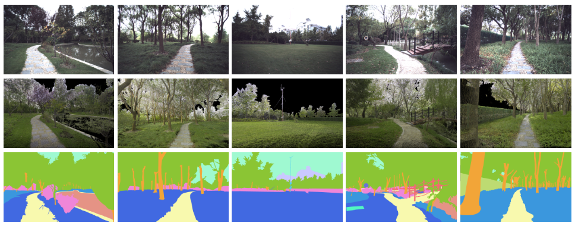
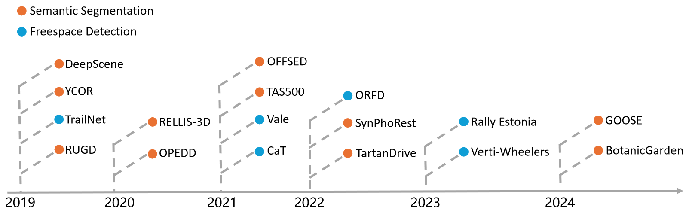

# [A Comprehensive Survey on Autonomous Driving in Unstructured Environments](https://arxiv.org/xxx) [](https://github.com/sindresorhus/awesome)  [](https://arxiv.org/abs/xxx) 


<p align="center">
  
</p>

<p align="center">
(Source:<a href="https://openai.com/sora">ORFD</a>)
</p>


This is the official repository for the technical report: 

**A Comprehensive Survey on Autonomous Driving in Unstructured Environments**.


## 📌 Introduction

xxx

xxx

## Survey Papers for Autonomous Driving in Unstructured Environments 

| Year |              **Published**               |                     Author                     |                            Title                             |                Task                |
| ---- | :--------------------------------------: | :--------------------------------------------: | :----------------------------------------------------------: | :--------------------------------: |
| 2020 |                 Sensors                  |    Università degli Studi di Catania, Italy    | [Learning-Based Methods of Perception and Navigation for Ground Vehicles in Unstructured Environments: A Review](https://www.mdpi.com/1424-8220/21/1/73) |     Perception and Navigation      |
| 2022 |                   JFR                    | Queensland University of Technology, Australia | [A Survey on Terrain Traversability Analysis for Autonomous Ground Vehicles: Methods, Sensors, and Challenges](https://www.journalfieldrobotics.org/Field_Robotics/Volume_2_files/Vol2_49.pdf) |      Traversability Analysis       |
| 2022 |                 Sensors                  |       Mississippi State University, USA        | [Off-Road Detection Analysis for Autonomous Ground Vehicles: A Review](https://www.mdpi.com/1424-8220/22/21/8463) |      Traversability Analysis       |
| 2023 |             Applied Sciences             |       Edith Cowan University,  Australia       | [Challenges and Solutions for Autonomous Ground Robot Scene Understanding and Navigation in Unstructured Outdoor Environments: A Review](https://www.mdpi.com/2076-3417/13/17/9877) | Scene Understanding and Navigation |
| 2023 | Journal of Intelligent & Robotic Systems |  Memorial University of Newfoundland, Cannada  | [A Survey of Off-Road Mobile Robots: Slippage Estimation, Robot Control, and Sensing Technology](https://link.springer.com/article/10.1007/s10846-023-01968-2) |           Mobile Robots            |
| 2024 |                 Machines                 |            Jilin University, China             | [A Survey on Path Planning for Autonomous Ground Vehicles in Unstructured Environments](https://www.mdpi.com/2075-1702/12/1/31) |           Path Planning            |
| 2024 |              ICRA workshop               |  University of the Bundeswehr Munich, Germany  | [Survey on Datasets for Perception in Unstructured Outdoor Environments](https://arxiv.org/abs/2404.18750) |              Datasets              |

## Papers for Autonomous Driving Datasets in Unstructured Environments 



| Year |                           Datasets                           |                            Title                             |                Sensors                 |                            Task                             |                             Link                             |
| :--: | :----------------------------------------------------------: | :----------------------------------------------------------: | :------------------------------------: | :---------------------------------------------------------: | :----------------------------------------------------------: |
| 2017 | [DeepScene](https://link.springer.com/chapter/10.1007/978-3-319-50115-4_41) | [Deep Multispectral Semantic Scene Understanding of Forested Environments Using Multimodal Fusion](https://link.springer.com/chapter/10.1007/978-3-319-50115-4_41) |          RGB, NIR, and depth           |                    Semantic Segmentation                    |  [Download](http://deepscene.cs.uni-freiburg.de/#datasets)   |
| 2018 | [YCOR](https://link.springer.com/chapter/10.1007/978-3-319-67361-5_22) | [YCOR: Real-Time Semantic Mapping for Autonomous Off-Road Navigation](https://link.springer.com/chapter/10.1007/978-3-319-67361-5_22) |                  RGB                   |                    Semantic Segmentation                    |          [Download](https://dimatura.net/offroad/)           |
| 2018 | [TrailNet](https://pdfs.semanticscholar.org/6008/e459f5d1226843eb88ea1af029687c9d2287.pdf) | [Autonomous Trail Following using a Pre-trained Deep Neural Network](https://pdfs.semanticscholar.org/6008/e459f5d1226843eb88ea1af029687c9d2287.pdf) |               RGB Camera               |                  Traversability Estimation                  |     [Download](https://vgr.lab.yorku.ca/tools/trailnet/)     |
| 2019 | [RUGD](https://ieeexplore.ieee.org/abstract/document/8968283) | [A RUGD Dataset for Autonomous Navigation and Visual Perception in Unstructured Outdoor Environments](https://ieeexplore.ieee.org/abstract/document/8968283) |                  RGB                   |                    Semantic Segmentation                    |  [Download](https://www.dfki.uni-kl.de/~neigel/offsed.html)  |
| 2020 | [OPEDD](https://www.dfki.de/fileadmin/user_upload/import/10861_WSCG_OPEDD.pdf) | [OPEDD: Off-Road Pedestrian Detection Dataset](https://www.dfki.de/fileadmin/user_upload/import/10861_WSCG_OPEDD.pdf) |             Stereo images              |                    Pedestrian Detection                     |  [Download](https://www.dfki.uni-kl.de/~neigel/offsed.html)  |
| 2020 |        [RELLIS-3D](https://arxiv.org/abs/2011.12954)         | [RELLIS-3D: A Multi-modal Dataset for Off-Road Robotics](https://arxiv.org/abs/2011.12954) |             camera, LiDAR              |                    Semantic Segmentation                    |     [Download](https://github.com/unmannedlab/RELLIS-3D)     |
| 2021 | [OFFSED](https://www.dfki.de/fileadmin/user_upload/import/11376_OFFSEDD_VISAPP2021.pdf) | [OFFSED: Off-Road Semantic Segmentation Dataset](https://www.dfki.de/fileadmin/user_upload/import/11376_OFFSEDD_VISAPP2021.pdf) |           RGB, stereo depth            |                    Semantic Segmentation                    |  [Download](https://www.dfki.uni-kl.de/~neigel/offsed.html)  |
| 2021 | [TAS500](https://ieeexplore.ieee.org/abstract/document/9411987) | [A Fine-Grained Dataset and its Efficient Semantic Segmentation for Unstructured Driving Scenarios](https://ieeexplore.ieee.org/abstract/document/9411987) |                  RGB                   |                    Semantic Segmentation                    |      [Download](https://www.mucar3.de/icpr2020-tas500)       |
| 2021 | [Vale](https://ieeexplore.ieee.org/abstract/document/9551629) | [Traversability Analysis by Semantic Terrain Segmentation for Mobile Robots](https://ieeexplore.ieee.org/abstract/document/9551629) |               RGB Camera               |                  Traversability Estimation                  | [Download](https://www.kaggle.com/datasets/sadhoss/vale-semantic-terrain-segmentation) |
| 2021 | [CaT](https://ieeexplore.ieee.org/abstract/document/9721297) | [CaT: CAVS Traversability Dataset for Off-Road Autonomous Driving](https://ieeexplore.ieee.org/abstract/document/9721297) |               RGB camera               |                  Traversability Estimation                  |           [Download](https://datasetninja.com/cat)           |
| 2022 |  [SynPhoRest](https://openreview.net/forum?id=rpzgjNCe4G9)   | [Procedural Generation of Synthetic Forest Environments to Train Machine Learning Algorithms](https://openreview.net/forum?id=rpzgjNCe4G9) |           RGB, Depth, LiDAR            |                    Semantic Segmentation                    |        [Download](https://zenodo.org/records/6369446)        |
| 2022 |       [TartanDrive](https://arxiv.org/pdf/2205.01791)        | [TartanDrive: A Large-Scale Dataset for Learning Off-Road Dynamics Models](https://arxiv.org/pdf/2205.01791) |            stereo images -             |                              -                              |     [Download](https://github.com/castacks/tartan_drive)     |
| 2022 |           [ORFD](https://arxiv.org/abs/2206.09907)           | [ORFD: A Dataset and Benchmark for Off-Road Freespace Detection](https://arxiv.org/abs/2206.09907) |          RGB camera and LiDAR          |                  Traversability Estimation                  | [Download](https://github.com/chaytonmin/Off-Road-Freespace-Detection) |
| 2023 |  [Rally Estonia](https://www.mdpi.com/1424-8220/23/5/2845)   | [LiDAR-as-Camera for End-to-End Driving](https://www.mdpi.com/1424-8220/23/5/2845) |          RGB camera and LiDAR          |                  Traversability Estimation                  |   [Download](https://github.com/UT-ADL/e2e-rally-estonia)    |
| 2023 |      [Verti-Wheelers](https://arxiv.org/abs/2303.00998)      | [Toward Wheeled Mobility on Vertically Challenging Terrain: Platforms, Datasets, and Algorithms](https://arxiv.org/abs/2303.00998) |             Kinect Camera              |                  Traversability Estimation                  | [Download](https://cs.gmu.edu/~xiao/Research/Verti-Wheelers/) |
| 2024 | [BotanicGarden](https://ieeexplore.ieee.org/abstract/document/10415477/) | [BotanicGarden: A High-Quality Dataset for Robot Navigation in Unstructured Natural Environments](https://ieeexplore.ieee.org/abstract/document/10415477/) | Gray and RGB stereo cameras, and LiDAR | Ego-motions, 3D map ground truth, and Semantic Segmentation |   [Download](https://github.com/robot-pesg/BotanicGarden)    |
| 2024 |          [GOOSE](https://arxiv.org/abs/2310.16788)           | [The GOOSE Dataset for Perception in Unstructured Environments](https://arxiv.org/abs/2310.16788) |            RGB+NIR / LiDAR             |                    Semantic Segmentation                    |            [Download](https://goose-dataset.de/)             |
|      |                                                              |                                                              |                                        |                                                             |                                                              |
| 2024 |                            Survey                            | [Survey on Datasets for Perception in Unstructured Outdoor Environments](https://arxiv.org/abs/2404.18750) |             ICRA workshop              |             University of the Bundeswehr Munich             |                              -                               |


## Papers for Autonomous Driving Perception in Unstructured Environments 


| Year |                        **Published**                         |                            Author                            |                            Title                             |                       Task                       | Github |
| ---- | :----------------------------------------------------------: | :----------------------------------------------------------: | :----------------------------------------------------------: | :----------------------------------------------: | :----: |
| 2003 |                              IV                              | Vehicle-Infrastructure-Driver Interactions Research Unit - LIkX | [ Vehicle Roll, Pitch, Yaw  Estimation and Obstacles Detection by Stereovision](https://ieeexplore.ieee.org/abstract/document/1212878) |                Obstacle Detection                |   -    |
| 2004 |                              -                               |                  Carnegie Mellon University                  | [Vegetation Detection for Mobile Robot Navigation](https://www.ri.cmu.edu/pub_files/pub4/bradley_david_2004_2/bradley_david_2004_2.pdf) |           Positive Obstacle Detection            |   -    |
| 2004 |                             ICRA                             |                  Carnegie Mellon University                  | [Classifier Fusion for Outdoor Obstacle Detection](https://ieeexplore.ieee.org/abstract/document/1307225/) |                Obstacle Detection                |   -    |
| 2005 |                        CVPR workshop                         |                     University of Parma                      | [Obstacle Detection with Stereo Vision for Off-Road Vehicle Navigation](https://ieeexplore.ieee.org/abstract/document/1565369) |                Obstacle Detection                |   -    |
| 2005 |                              -                               |             Jet Propulsion Laboratory, Pasadena              | [Evaluation of Stereo Vision Obstacle Detection Algorithms for Off-Road Autonomous Navigation](https://d1wqtxts1xzle7.cloudfront.net/36673835/05-1610-libre.pdf?1424219841=&response-content-disposition=inline%3B+filename%3DEvaluation_of_Stereo_Vision_Obstacle_Det.pdf&Expires=1717984213&Signature=P~hg592-dGdU5alAgHlnEmkBsjbHcBDEszK45scSO6jLshX-hPqYdOMq700kJnsU7QI6tdJaLmRTkI4pcJ6m2tUH-Pqc65azQU24edIcOPuQGqI2EwJOYN17cjJ~q0DE5tU0Z1c~oxg9QlKE11RzeNLhiVk~ocqc-cyI19F9djL8YIfLqid7y0rNOuo3D3ltgCQU9K0ReXXnYUn-2ToymRlbNycsCXBx20XxlySSEi0zP6oghhDALMTmzTQhs9IS5CWcx5D7KC8-Nr9n0hPQE4Mc92oqEYrXDQ5VcgHC4w~ihRWt~KY5~GUJkBF111swgW~Lmgcybb73BsLBc51uHw__&Key-Pair-Id=APKAJLOHF5GGSLRBV4ZA) |                Obstacle Detection                |   -    |
| 2005 |                             WACV                             |              California Institute of Technology              | [Stereo-Based Tree Traversability Analysis for Autonomous Off-Road Navigation]() |       Positive Obstacle (Forest）Detection       |   -    |
| 2005 |                      Autonomous robots                       |         California Institute of Technology, Pasadena         | [Obstacle Detection and Terrain Classification for Autonomous Off-Road Navigation](https://link.springer.com/article/10.1023/B:AURO.0000047286.62481.1d) |  Obstacle Detection and Terrain Classification   |   -    |
| 2007 |                             IROS                             |                  Carnegie Mellon University                  | [Potential Negative Obstacle Detection by Occlusion Labeling](https://ieeexplore.ieee.org/abstract/document/4398970) |           Negative Obstacle Detection            |   -    |
| 2011 |                             ITSC                             |             University of California, San Diego              | [Lidar Based Off-road Negative Obstacle Detection and Analysis](https://ieeexplore.ieee.org/abstract/document/6083105) |           Negative Obstacle Detection            |   -    |
| 2011 |                             IVS                              |              University of California San Diego              | [Off-Road Terrain Traversability Analysis and Hazard Avoidance for UGVs](https://apps.dtic.mil/sti/pdfs/ADA536652.pdf) |            Traversability Estimation             |   -    |
| 2011 |                             IROS                             |             SRI International Sarnoff, Princeton             | [A Graph Traversal based Algorithm for Obstacle Detection using Lidar or Stereo](https://ieeexplore.ieee.org/abstract/document/6094685) |           Positive Obstacle Detection            |   -    |
| 2013 |                           Robotica                           |                      University of Rome                      | [Mind the gap: detection and traversability analysis of terrain gaps using LIDAR for safe robot navigation](https://www.cambridge.org/core/journals/robotica/article/abs/mind-the-gap-detection-and-traversability-analysis-of-terrain-gaps-using-lidar-for-safe-robot-navigation/0268BC34F30891C3237589E7A3599D9F) |           Negative Obstacle Detection            |   -    |
| 2013 |                             IROS                             |              California Institute of Technology              | [High Fidelity Day/Night Stereo Mapping with Vegetation and Negative Obstacle Detection for Vision-in-the-Loop Walking](https://ieeexplore.ieee.org/abstract/document/6696879/) |           Negative Obstacle Detection            |   -    |
| 2014 | [International Conference on Intelligent Human-Machine Systems and Cybernetics](https://ieeexplore.ieee.org/xpl/conhome/6910079/proceeding) |                             BIT                              | [Two-Stage Obstacle Detection Based on Stereo Vision in Unstructured Environment]() |                Obstacle Detection                |   -    |
| 2015 |                             ICIT                             |                    University of Salento                     | [Traversability Analysis for Off-Road Vehicles using Stereo and Radar Data](https://ieeexplore.ieee.org/abstract/document/7125155) | Obstacle Detection and Traversability Estimation |   -    |
| 2016 |                            ICSEE                             |               Tel Aviv College of Engineering                | [Off-road Path and Obstacle Detection using Monocular Camera](https://ieeexplore.ieee.org/abstract/document/7806132) |                Obstacle Detection                |   -    |
| 2017 |                             ICCA                             |               Nanyang Technological University               | [Stereo Vision based Negative Obstacle Detection](https://ieeexplore.ieee.org/abstract/document/8003168) |           Negative Obstacle Detection            |   -    |
| 2018 |                             IFAC                             |                   Northwest A&F University                   | [Dynamic obstacle detection based on multi-sensor information fusion](https://www.academia.edu/download/99422543/j.ifacol.2018.08.08620230305-1-nu1ehj.pdf) |                Obstacle Detection                |   -    |
| 2019 |                            ICVES                             |            Beijing Institute of Technology, (BIT)            | [A Novel Method of Traversable Area Extraction Fused With LiDAR Odometry in Off-road Environment](https://ieeexplore.ieee.org/abstract/document/8906333/) |            Traversability Estimation             |   -    |
| 2019 | [Chinese Control Conference (CCC)](https://ieeexplore.ieee.org/xpl/conhome/8844507/proceeding) |                             BIT                              | [Lidar-based Traversable Region Detection in Off-road Environment](https://ieeexplore.ieee.org/abstract/document/8865250) |            Traversability Estimation             |   -    |
| 2019 |                              IV                              |                             PKU                              | [Off-Road Drivable Area Extraction Using 3D LiDAR Data](https://ieeexplore.ieee.org/abstract/document/8814143/) |            Traversability Estimation             |   -    |
| 2020 |                              IV                              |                             PKU                              | [Off-road Autonomous Vehicles Traversability Analysis and Trajectory Planning Based on Deep Inverse Reinforcement Learning](https://ieeexplore.ieee.org/abstract/document/9304721/) |            Traversability Estimation             |   -    |
| 2020 |                             ICRA                             |                      McGill University                       | [Learning to Drive Off Road on Smooth Terrain in Unstructured Environments Using an On-Board Camera and Sparse Aerial Images](https://ieeexplore.ieee.org/abstract/document/9196879/) |            Traversability Estimation             |   -    |
| 2020 |                           Sensors                            |                      Xiamen University                       | [Novel Laser-Based Obstacle Detection for Autonomous Robots on Unstructured Terrain](https://www.mdpi.com/1424-8220/20/18/5048) |                Obstacle Detection                |   -    |
| 2021 |              Measurement Science and Technology              |                      Nankai University                       | [Point cloud segmentation based on Euclidean clustering and multi-plane extraction in rugged field](https://iopscience.iop.org/article/10.1088/1361-6501/abead3/meta) |             Point cloud segmentation             |   -    |
| 2021 |                             IROS                             |                             PKU                              | [Fine-Grained Off-Road Semantic Segmentation and Mapping via Contrastive Learning](https://arxiv.org/pdf/2103.03651) |            Traversability Estimation             |   -    |
| 2022 |                             IRC                              |                University of Technology Graz                 | [Generating Robot-Dependent Cost Maps for Off-Road Environments Using Locomotion](https://ieeexplore.ieee.org/abstract/document/10023567/) |                    Cost Maps                     |   -    |
| 2023 |                             JFR                              |                             NUDT                             | [Traversability Analysis for Autonomous Driving in Complex Environment: A LiDAR-based Terrain Experiments and Earth Observation Data](https://arxiv.org/pdf/2307.02060) |            Traversability Estimation             |   -    |
| 2023 |                             TITS                             |                             PKU                              | [An Active and Contrastive Learning Framework for Fine-Grained Off-Road Semantic Segmentation Modeling Approach](https://arxiv.org/pdf/2202.09002) |              Semantic Segmentation               |   -    |
| 2023 |                             CCC                              |                             BIT                              | [LiDAR-based Online Cost Map Construction in Complex Off-road Environments](https://ieeexplore.ieee.org/abstract/document/10240841/) |            Traversability Estimation             |   -    |
| 2023 |                             RAL                              |                      Clemson University                      | [Data-Driven Convex Approach to Off-road Navigation via Linear Transfer Operators]() |            Traversability Estimation             |   -    |
| 2023 |                            Arxiv                             |                             NUDT                             | [Contrastive Label Disambiguation for Self-Supervised Terrain Traversability Learning in Off-Road Environments](https://arxiv.org/pdf/2307.02871) |            Traversability Estimation             |        |
| 2023 |                             RAL                              |         Agency for Defense Development (ADD), Korea          | [ScaTE: A Scalable Framework for Self-Supervised Traversability Estimation in Unstructured Environments](https://arxiv.org/pdf/2209.06522) |    Self-Supervised Traversability Estimation     |   -    |
| 2023 |                             RAL                              |                          ADD, Korea                          | [Learning Off-Road Terrain Traversability with Self-Supervisions Only](https://arxiv.org/pdf/2305.18896) |    Self-Supervised Traversability Estimation     |   -    |
| 2023 |                         IEEE Access                          |                          ADD, Korea                          | [Self-Supervised 3D Traversability Estimation With Proxy Bank Guidance](https://ieeexplore.ieee.org/stamp/stamp.jsp?arnumber=10132443) |   Self-Supervised 3D Traversability Estimation   |   -    |
| 2023 |                            Arxiv                             |                          ADD, Korea                          | [METAVerse: Meta-Learning Traversability Cost Map for Off-Road Navigation](https://arxiv.org/pdf/2307.13991) |            Traversability Estimation             |   -    |
| 2023 |                         RSS workshop                         |                          ADD, Korea                          | [Safe Navigation in Unstructured Environments by Minimizing Uncertainty in Control and Perception](https://arxiv.org/pdf/2306.14601) |   Terrain Map Estimation,Uncertainty learning    |   -    |
| 2023 |                             ICRA                             |                  Carnegie Mellon University                  | [Learning Risk-Aware Costmaps via Inverse Reinforcement Learning for Off-Road Navigation](https://ieeexplore.ieee.org/abstract/document/10161268) |                     Costmaps                     |   -    |
| 2023 |                World Electric Vehicle Journal                |                     Southeast University                     | [Off-Road Environment Semantic Segmentation for Autonomous Vehicles Based on Multi-Scale Feature Fusion]() |              Semantic Segmentation               |   -    |
| 2023 |                             TIV                              |                    Sun Yat-sen University                    | [LiDAR Based Traversable Regions Identification Method for Off-Road UGV Driving](https://ieeexplore.ieee.org/abstract/document/10360316) |            Traversability Estimation             |   -    |
| 2023 |                            Arxiv                             |                   University of Washington                   | [V-STRONG: Visual Self-Supervised Traversability Learning for](https://arxiv.org/html/2312.16016v1) |            Traversability Estimation             |   -    |
| 2024 |                        ICRA workshop                         |                          ADD, Korea                          | [Uncertainty-aware Semantic Mapping in Off-road Environments with Dempster-Shafer Theory of Evidence](https://arxiv.org/pdf/2405.06265) |        Uncertainty-aware Semantic Mapping        |   -    |
| 2024 |                            Arxiv                             |                          ADD, Korea                          | [Evidential Semantic Mapping in Off-road Environments with Uncertainty-aware Bayesian Kernel Inference](https://arxiv.org/pdf/2403.14138) |                 Semantic Mapping                 |   -    |
| 2024 |                            Arxiv                             |                          ADD, Korea                          | [UFO: Uncertainty-aware LiDAR-image Fusion for Off-road](https://arxiv.org/pdf/2403.02642) |            Traversability Estimation             |   -    |
| 2024 |                             RAL                              |              California Institute of Technology              | [Pixel to Elevation: Learning to Predict Elevation Maps at Long Range]() |                  Elevation Maps                  |   -    |
| 2024 |                            Arxiv                             |              California Institute of Technology              | [RoadRunner - Learning Traversability Estimation for Autonomous Off-road Driving](https://arxiv.org/pdf/2402.19341) |            Traversability Estimation             |   -    |
| 2024 |                     IEEE Sensors Journal                     |                     Southeast University                     | [Multisensor Fusion Network for Unstructured Scene Segmentation With Surface Normal Incorporated](https://ieeexplore.ieee.org/abstract/document/10458907/) |             Point cloud segmentation             |   -    |


## Papers for Autonomous Driving Planning in Unstructured Environments 


| Year | **Published** | Author | Title | Task | Github |
| ---- | :-----------: | :----: | :---: | :--: | :----: |
|      |               |        |       |      |        |
|      |               |        |       |      |        |
|      |               |        |       |      |        |
|      |               |        |       |      |        |
|      |               |        |       |      |        |
|      |               |        |       |      |        |
|      |               |        |       |      |        |
|      |               |        |       |      |        |
|      |               |        |       |      |        |
|      |               |        |       |      |        |
|      |               |        |       |      |        |
|      |               |        |       |      |        |
|      |               |        |       |      |        |
|      |               |        |       |      |        |
|      |               |        |       |      |        |
|      |               |        |       |      |        |
|      |               |        |       |      |        |
|      |               |        |       |      |        |
|      |               |        |       |      |        |
|      |               |        |       |      |        |
|      |               |        |       |      |        |
|      |               |        |       |      |        |
|      |               |        |       |      |        |
|      |               |        |       |      |        |
|      |               |        |       |      |        |
|      |               |        |       |      |        |
|      |               |        |       |      |        |
|      |               |        |       |      |        |
|      |               |        |       |      |        |

## Papers for Autonomous Driving Mapping & Localization in Unstructured Environments 


| Number | Year | **Published** | Author | Title | Task | Github |
|  :--:  | ---- | :-----------: | :----: | :---: | :--: | :----: |
| 1 | 2021 |        JFR       |    NUDT    |    [LiDAR‐based robust localization for field autonomous vehicles in off‐road environments](https://onlinelibrary.wiley.com/doi/abs/10.1002/rob.22031)    |    Mapping then Localization  |    -    |
| 2 | 2021 |        Remote Sensing       |    NUDT    |    [Towards a fully automated 3d reconstruction system based on lidar and gnss in challenging scenarios](https://www.mdpi.com/2072-4292/13/10/1981)    |   Mapping   |    -    |
|  |      |               |        |       |      |        |
|  |      |               |        |       |      |        |
|  |      |               |        |       |      |        |
|  |      |               |        |       |      |        |
|  |      |               |        |       |      |        |


## Contact

If you find our survey is useful in your research or applications, please consider giving us a star 🌟 and citing it by the following BibTeX entry.

```
@article{xxx,
  title={A Comprehensive Survey on Autonomous Driving in Unstructured Environments},
  author={xxx}, 
  journal={arXiv preprint arXiv:xxx},
  year={2024}
}
```
